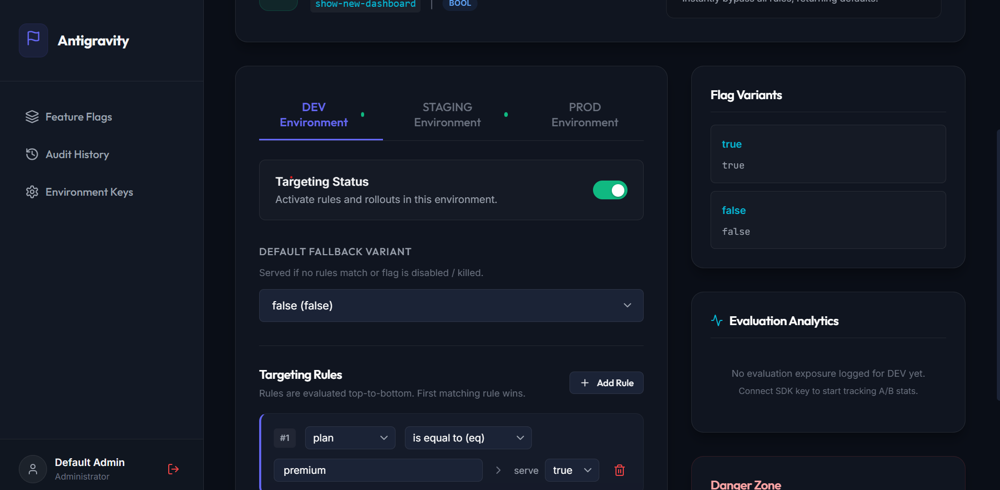
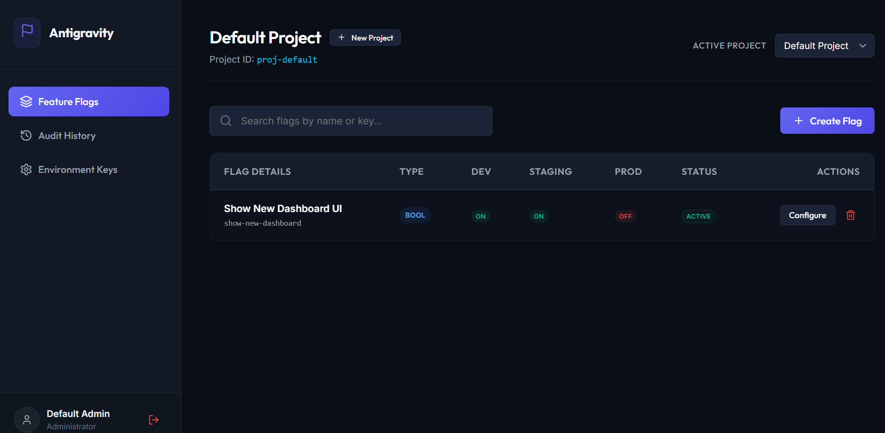
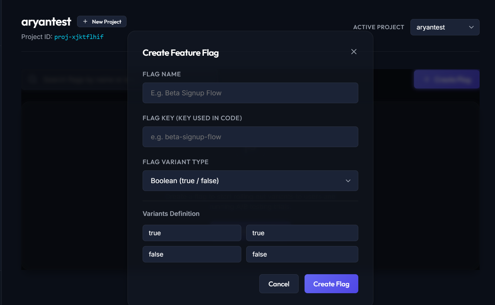

# Feature Flag & Targeting System

An enterprise-grade, real-time feature flag and targeting engine (similar to LaunchDarkly) built from scratch. It features sub-5ms evaluations, percentage rollouts, attribute-based targeting rules, real-time push updates via Server-Sent Events (SSE), and a modern React dashboard.

The system is deployed and active in the cloud, utilizing a serverless Neon PostgreSQL database, an Express backend API on Render, an Admin Console on Vercel, and a client SDK published on NPM.

---

## 📸 Demo Console Screenshots

| Dashboard Overview | Targeting Rules & Rollout | Live Simulator Playground |
| :---: | :---: | :---: |
|  |  |  |

---

## 🌍 Deployed Services

* **Admin Dashboard (Vercel)**: Hosted live in the cloud. Log in with your admin credentials or sign up for a new account.
* **Backend API Engine (Render)**: `https://feature-flag-system-gszd.onrender.com`
* **Database (Neon)**: Fully managed serverless PostgreSQL instance.
* **Client SDK (NPM)**: Published as `feature-flag-client-sdk` for instant installation.

---

## 📦 Client SDK Integration

Install the package directly into your application:
```bash
npm install feature-flag-client-sdk
```

### Quick Usage Example
Initialize the client with your SDK environment key and point it to the live backend URL:

```typescript
import { FeatureFlagClient } from 'feature-flag-client-sdk';

const client = new FeatureFlagClient('YOUR_SDK_KEY', {
  baseUrl: 'https://feature-flag-system-gszd.onrender.com',
  enableStream: true // Enable real-time updates via Server-Sent Events
});

// Bootstrap configurations and listen for updates
await client.initialize();

// Define user attributes
const user = {
  userId: 'user-premium-101',
  email: 'user@company.com',
  plan: 'premium',
  country: 'US'
};

// Evaluate instantly (sub-1ms local check)
const showBeta = client.evaluate('show-beta-banner', user, false);

if (showBeta.value) {
  console.log('Rendering new beta banner!');
}

// Receive push notifications from the dashboard in real-time
client.onUpdate(() => {
  console.log('Flags updated on dashboard! Refetching latest states...');
});
```

---

## ⚙️ How targeting works under the hood

1. **Local Evaluation Engine**: When the client app calls `.evaluate()`, it doesn't make any network requests. Instead, it checks rules locally against cached flags retrieved during bootstrap.
2. **Real-time SSE Sync**: If you change flag states, edit target rules, or hit the **Emergency Kill Switch** on the Vercel dashboard, a Server-Sent Events (SSE) notification is pushed to all active SDK client instances in sub-seconds.
3. **Deterministic Percentage Rollouts**: Rollouts use MurmurHash v3: `murmurhash.v3(userId + ':' + flagKey) % 100`. This ensures the same user always gets the same variant consistently without storing mapping states in a database.
4. **Buffered Analytics**: Evaluation events are queued in the background and flushed to the backend API every few seconds to feed the dashboard A/B metrics and exposure charts.

---

## 🛠️ Local Development & Testing

If you want to run the codebase locally:

### 1. Run the Backend API Server
Configure a local `.env` file in `/backend` using `.env.example` as a template:
```bash
cd backend
npm install
npm run dev
```

### 2. Start the Admin Dashboard Console
```bash
cd frontend
npm install
npm run dev
```
Open [http://localhost:3000](http://localhost:3000) in your browser.
