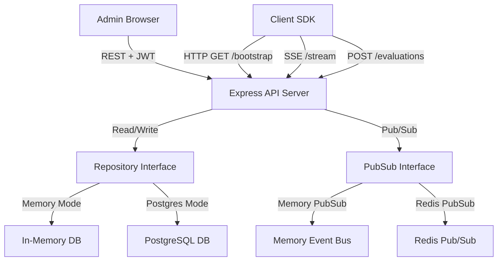

# Implementation Plan - Feature Flag System

Build a production-grade, backend-first feature flag platform similar to LaunchDarkly, with Node.js + Express + TypeScript, a React admin dashboard, and a client SDK with real-time updates (SSE) and deterministic bucketing. 

To support development without active PostgreSQL and Redis instances initially (as per user constraints), we will design the backend with a **clean repository/provider pattern**. It will use in-memory database and pub/sub providers by default, but include the SQL DDL schemas and standard PostgreSQL/Redis repository code so that swapping to a production database/cache is a matter of configuration.

---

## User Review Required

> [!IMPORTANT]
> **Database & Cache Fallback Strategy**:
> Since PostgreSQL and Redis are not currently available on the local environment, the system will use an in-memory repository layer and an in-memory pub/sub bus by default. The PostgreSQL/Redis code will be prepared and can be toggled via environment variables (`DB_TYPE=memory|postgres` and `CACHE_TYPE=memory|redis`).

> [!TIP]
> **Deterministic Bucketing**:
> We will use `murmurhash-js` for percentage rollouts, calculating the bucket as `murmurhash.v3(userId + ':' + flagKey) % 100`. This is 10x faster than crypto hashing and matches production systems.

---

## Open Questions

> [!NOTE]
> 1. **Default Project/SDK Key**:
>    We will bootstrap the system with a default project (e.g., `Default Project`) and three environments (`dev`, `staging`, `prod`) with auto-generated SDK keys (e.g., `sdk_dev_default`) so you can test the SDK immediately.
> 2. **Authentication Setup**:
>    Should we pre-create a default admin user (e.g., `admin@example.com` / `admin123`) to make it easier to log into the dashboard on first launch? We plan to do this.

---

## Proposed Changes

We will create a multi-folder structure under [feature-flag-system](file:///c:/Users/Dell/Downloads/koding repos/feature-flag-system):
- `backend/` - The Express API server
- `frontend/` - React dashboard built with Vite
- `sdk/` - Client SDK with local caching, SSE reconnect, and async evaluation logging
- `shared/` - Common interfaces and the pure evaluation engine

---

### Shared Library (Core & Evaluation Engine)

Contains types and the pure evaluation logic.

#### [NEW] [types.ts](file:///c:/Users/Dell/Downloads/koding%20repos/feature-flag-system/shared/types.ts)
Contains typescript interfaces for Flags, Variants, Environments, Rules, UserContext, AuditLog, and EvalResult.

#### [NEW] [evaluator.ts](file:///c:/Users/Dell/Downloads/koding%20repos/feature-flag-system/shared/evaluator.ts)
The pure evaluation function:
- Skips rules if `isKilled === true` -> returns `KILLED` reason.
- Evaluates rules in order of priority (lower priority values first). If a rule matches, returns `RULE_MATCH` reason.
- If no rule matches, checks for percentage rollout or returns the default variant with `FALLBACK` reason.

---

### Backend Service (Express + TypeScript)

#### [NEW] [package.json](file:///c:/Users/Dell/Downloads/koding%20repos/feature-flag-system/backend/package.json)
Standard dependencies: `express`, `cors`, `jsonwebtoken`, `bcryptjs`, `dotenv`, `murmurhash-js`, `pg`, `redis`, `zod`. Dev dependencies: `typescript`, `ts-node-dev`, `@types/express`, etc.

#### [NEW] [schema.sql](file:///c:/Users/Dell/Downloads/koding%20repos/feature-flag-system/backend/schema.sql)
The DDL script containing SQL table structures for `projects`, `project_environments`, `flags`, `flag_environments`, `flag_rules`, `flag_variants`, `audit_log`, `flag_evaluations`, and `admins`.

#### [NEW] [interfaces.ts](file:///c:/Users/Dell/Downloads/koding%20repos/feature-flag-system/backend/src/repositories/interfaces.ts)
Definitions of database repository interfaces (`IFlagRepository`, `IProjectRepository`, `IAuditLogRepository`, `IEvalLogRepository`, `IAdminRepository`).

#### [NEW] [memory-repo.ts](file:///c:/Users/Dell/Downloads/koding%20repos/feature-flag-system/backend/src/repositories/memory-repo.ts)
In-memory implementation of all repository interfaces.

#### [NEW] [postgres-repo.ts](file:///c:/Users/Dell/Downloads/koding%20repos/feature-flag-system/backend/src/repositories/postgres-repo.ts)
PostgreSQL pool-backed implementation of all repository interfaces.

#### [NEW] [pubsub.ts](file:///c:/Users/Dell/Downloads/koding%20repos/feature-flag-system/backend/src/services/pubsub.ts)
An event broker managing client connections and broadcasting flag-update events. When Redis is enabled, it uses Redis Pub/Sub; otherwise, it uses an in-memory `EventEmitter`.

#### [NEW] [webhook.ts](file:///c:/Users/Dell/Downloads/koding%20repos/feature-flag-system/backend/src/services/webhook.ts)
Service to trigger registered webhooks asynchronously when flags are modified.

#### [NEW] [controllers](file:///c:/Users/Dell/Downloads/koding%20repos/feature-flag-system/backend/src/controllers/)
- `auth.controller.ts`: Handles admin signup/login and JWT generation.
- `flag.controller.ts`: CRUD for flags, environments, and rules. Publishes updates and writes audit logs.
- `sdk.controller.ts`:
  - `GET /api/v1/sdk/bootstrap`: Returns all enabled flags for the environment key.
  - `GET /api/v1/sdk/stream`: SSE endpoint subscribing to updates.
  - `POST /api/v1/sdk/evaluations`: Batch-logs flag evaluation analytics.

#### [NEW] [app.ts](file:///c:/Users/Dell/Downloads/koding%20repos/feature-flag-system/backend/src/app.ts)
Express application initialization, middleware routing, and standard SDE error handling.

---

### Client SDK

#### [NEW] [sdk.ts](file:///c:/Users/Dell/Downloads/koding%20repos/feature-flag-system/sdk/sdk.ts)
Client SDK implementation with:
- Local storage/in-memory cache.
- Periodic background sync and real-time SSE stream listener.
- Evaluation logic wrapper using local cache.
- Async event buffering for evaluation analytics.

---

### Admin Dashboard (React + Vite + TypeScript)

#### [NEW] [dashboard](file:///c:/Users/Dell/Downloads/koding%20repos/feature-flag-system/frontend/)
A React project with a premium look-and-feel (curated color palettes, dark mode, glassmorphism, responsive flex layouts).
Features:
- **Login screen**: Simple and sleek credentials-based JWT login.
- **Flags List**: Live table showing status (Active/Killed), variant types, environments.
- **Flag Details Editor**:
  - Edit basic information.
  - Kill switch toggler.
  - Variant manager.
  - Ordered rule-builder with priority sorting.
  - Default rollout percentage controls.
- **Audit Logs View**: Chronological log of modifications with before/after diff details.
- **Analytics View**: Visual feedback displaying variant exposure metrics.

---

## Verification Plan

### Automated Tests
- Build basic unit tests for the evaluation engine:
  - Boolean flag evaluations.
  - Multivariate flag evaluations.
  - Targeting rule priority (lower wins).
  - Murmurhash rollout bucketing.
  - Kill-switch logic.
- We will place these tests in [backend/tests/evaluator.test.ts](file:///c:/Users/Dell/Downloads/koding%20repos/feature-flag-system/backend/tests/evaluator.test.ts) and run them via `npm test`.

### Manual Verification
- Start the server on port `3001` and Vite frontend on `3000`.
- Log in, create a multivariate flag, add rules, and toggle the kill switch.
- Run a demo client script that evaluates flags for users with different attributes, and verify that:
  - Evaluation results match expectations.
  - Analytics events are posted back.
  - Real-time updates trigger via SSE on flag edits.
