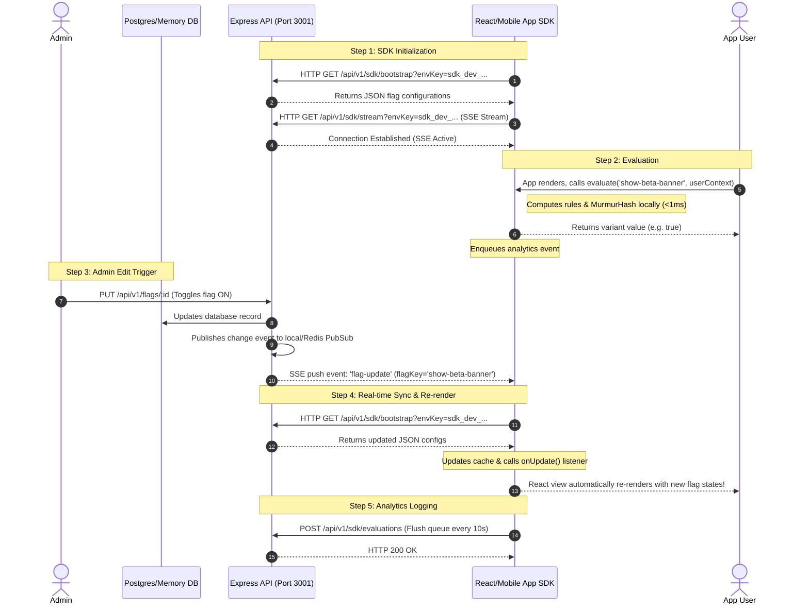

# Integration & Testing Guide - React & React Native

This guide provides a deep understanding of the architecture, data flows, and code patterns needed to integrate and test the Antigravity Feature Flag system in both React (Web) and React Native (Mobile) applications.

---

## 🏗️ System Architecture & Data Flow

Antigravity uses a **decoupled control-plane vs data-plane architecture**. The backend acts as the control plane (managing database, pub/sub, SSE streaming, and analytics collection). The client SDK operates as the data plane, evaluating configurations locally in under `< 1ms` from a local memory cache without making API calls on every evaluation.

### Sequence Diagram: Real-Time Configuration Updates & Evaluations



---

## ⚛️ React Integration (Web Website)

Integrating the SDK into a React website is best achieved using **React Context**. This allows initializing the SDK client once and broadcasting state updates so your components re-render immediately when a flag changes on the server.

### 1. Create the Feature Flag Context (`FeatureFlagProvider.tsx`)

```typescript
import React, { createContext, useContext, useEffect, useState } from 'react';
import { FeatureFlagClient } from './sdk'; // Import the SDK class

interface UserContext {
  userId: string;
  email?: string;
  plan?: string;
  country?: string;
  [key: string]: any;
}

interface FeatureFlagContextProps {
  client: FeatureFlagClient | null;
  evaluate: (flagKey: string, fallbackValue: any) => any;
  loading: boolean;
  version: number; // Incrementing version triggers consumer updates
}

const FFContext = createContext<FeatureFlagContextProps>({
  client: null,
  evaluate: () => null,
  loading: true,
  version: 0
});

export const FeatureFlagProvider: React.FC<{
  sdkKey: string;
  userContext: UserContext;
  children: React.ReactNode;
}> = ({ sdkKey, userContext, children }) => {
  const [client, setClient] = useState<FeatureFlagClient | null>(null);
  const [loading, setLoading] = useState(true);
  const [version, setVersion] = useState(0);

  useEffect(() => {
    // Instantiate SDK
    const ffClient = new FeatureFlagClient(sdkKey, {
      baseUrl: 'http://localhost:3001',
      flushInterval: 5000, // Flush evaluations back to DB every 5s
      enableStream: true   // Turn on real-time SSE pushes
    });

    // Start connection
    ffClient.initialize()
      .then(() => {
        setClient(ffClient);
        setLoading(false);
        setVersion(v => v + 1);
      })
      .catch(err => {
        console.error('Failed to initialize feature flags:', err);
        setLoading(false);
      });

    // Set callback to re-render React components on server updates
    ffClient.onUpdate(() => {
      console.log('[FeatureFlags] Config changed, triggering update...');
      setVersion(v => v + 1);
    });

    return () => {
      ffClient.destroy();
    };
  }, [sdkKey]);

  // Wrapper evaluator to pass user context
  const evaluate = (flagKey: string, fallbackValue: any) => {
    if (!client) return fallbackValue;
    const res = client.evaluate(flagKey, userContext, fallbackValue);
    return res.value;
  };

  return (
    <FFContext.Provider value={{ client, evaluate, loading, version }}>
      {children}
    </FFContext.Provider>
  );
};

export const useFeatureFlag = (flagKey: string, fallbackValue: any) => {
  const { evaluate, version } = useContext(FFContext);
  // Re-run evaluation when 'version' state changes
  return React.useMemo(() => evaluate(flagKey, fallbackValue), [flagKey, evaluate, version, fallbackValue]);
};
```

### 2. Wrap your Application (`index.tsx`)

```tsx
import React from 'react';
import ReactDOM from 'react-dom/client';
import App from './App';
import { FeatureFlagProvider } from './FeatureFlagProvider';

const user = {
  userId: 'user_alice_99',
  email: 'alice@enterprise.com',
  plan: 'premium',
  country: 'US'
};

const root = ReactDOM.createRoot(document.getElementById('root') as HTMLElement);
root.render(
  <FeatureFlagProvider sdkKey="sdk_dev_default_key_123" userContext={user}>
    <App />
  </FeatureFlagProvider>
);
```

### 3. Consume in Components (`Banner.tsx`)

```tsx
import React from 'react';
import { useFeatureFlag } from './FeatureFlagProvider';

export default function Banner() {
  const showBetaBanner = useFeatureFlag('show-beta-banner', false);
  const checkoutVariant = useFeatureFlag('new-checkout-flow', 'legacy');

  return (
    <div>
      {showBetaBanner && (
        <div className="promo-banner">✨ Antigravity Premium Beta is Enabled!</div>
      )}
      
      {checkoutVariant === 'v2-modern' ? (
        <button className="neon-button">Checkout Now</button>
      ) : (
        <button className="grey-button">Standard Checkout</button>
      )}
    </div>
  );
}
```

---

## 📱 React Native Integration (Mobile Apps)

React Native handles JS execution similarly to browsers, but lacks browser-native modules like `window.EventSource` and `localStorage`.

### 1. Install Required Native Polyfills
You will need to install the following community libraries in your React Native project:
```bash
npm install react-native-eventsource @react-native-async-storage/async-storage
```

### 2. Adapt the Client SDK for Mobile
Because React Native does not support browser `localStorage`, you can adapt the `FeatureFlagClient` class to use AsyncStorage.

```typescript
import AsyncStorage from '@react-native-async-storage/async-storage';
import RNEventSource from 'react-native-eventsource';

// Custom options subclass for mobile
export class RNFeatureFlagClient extends FeatureFlagClient {
  constructor(sdkKey: string, options: any = {}) {
    // Override window EventSource with RNEventSource polyfill
    options.eventSourceClass = RNEventSource;
    super(sdkKey, options);
  }

  // Override LocalStorage write with AsyncStorage
  protected async saveToStorageMobile(): Promise<void> {
    try {
      const payload = JSON.stringify({
        environment: this.environment,
        flags: this.flags
      });
      await AsyncStorage.setItem(`ff_sdk_${this.sdkKey}`, payload);
    } catch (e) {
      console.warn('AsyncStorage write error', e);
    }
  }

  // Override LocalStorage read
  protected async loadFromStorageMobile(): Promise<void> {
    try {
      const cached = await AsyncStorage.getItem(`ff_sdk_${this.sdkKey}`);
      if (cached) {
        const parsed = JSON.parse(cached);
        this.environment = parsed.environment;
        this.flags = parsed.flags;
        console.log('[SDK] Loaded cached flags from AsyncStorage.');
      }
    } catch (e) {
       // Ignore
    }
  }
}
```

*Note: In the React Native provider component, you will call `RNFeatureFlagClient` instead of standard `FeatureFlagClient`.*

---

## 🔬 How to Test and Verify Everything is Working

To check if the setup is operating correctly and evaluate values accurately:

### Step 1: Monitor Initial Bootstrap Sync
When the app launches, check the network tab or terminal logs for the bootstrap endpoint:
- **Endpoint**: `http://localhost:3001/api/v1/sdk/bootstrap?envKey=YOUR_SDK_KEY`
- **Verification**: The response should return HTTP 200 with a payload containing the environment (e.g. `dev`) and the flags list:
  ```json
  {
    "environment": "dev",
    "flags": [
      {
        "key": "show-beta-banner",
        "variants": [{"name": "true", "value": true}, {"name": "false", "value": false}],
        "enabled": true,
        "rules": [...]
      }
    ]
  }
  ```

### Step 2: Verify Real-Time Updates (SSE Connection)
Inspect the active Server-Sent Events stream:
- **Endpoint**: `http://localhost:3001/api/v1/sdk/stream?envKey=YOUR_SDK_KEY`
- **Verification**: 
  1. In Chrome DevTools, click **Network** -> **EventStream** tab. You should see a persistent connection status of `200 OK` (or pending).
  2. Toggle the flag ON/OFF or add a rule in the admin panel and click **Save**.
  3. Look at your app console or Network EventStream. You should immediately see a pushed event:
     - **Event Type**: `flag-update`
     - **Data**: `{"flagKey": "show-beta-banner"}`
  4. The client console should immediately print: `Notification: Flags updated on server! Refetched latest cache.` and apply the changes visually.

### Step 3: Check Deterministic Rollout Bucketing
To test if rollout percentage math is working:
1. Configure a flag (e.g., `dark-mode-preview`) with **Weighted Rollout** set to `true: 50%` and `false: 50%`.
2. Evaluate the flag locally using a range of User IDs (e.g., `user-1`, `user-2`, `user-3`).
3. Under the hood, check the calculated murmurhash values:
   - `user-premium-101:show-beta-banner` resolves to a bucket index (0-99).
   - Verify that users whose hashes fall below 50 receive `true`, and those above 50 receive `false`.
   - The same User ID must *always* receive the exact same variant evaluation consistently.

### Step 4: Verify Analytics & Flush Loop
1. Play with the app to trigger evaluations.
2. In Chrome DevTools Network tab, wait for the flush interval timer (default 10s).
3. Look for a `POST` request to `/api/v1/sdk/evaluations`:
   - **Payload**:
     ```json
     {
       "sdkKey": "sdk_dev_default_key_123",
       "evaluations": [
         {
           "flagKey": "show-beta-banner",
           "variantReturned": "true",
           "userId": "user-premium-101",
           "timestamp": "2026-06-23T03:00:00.000Z"
         }
       ]
     }
     ```
4. Verify that the Exposure Analytics graph updates inside the console under the specific flag configuration.
